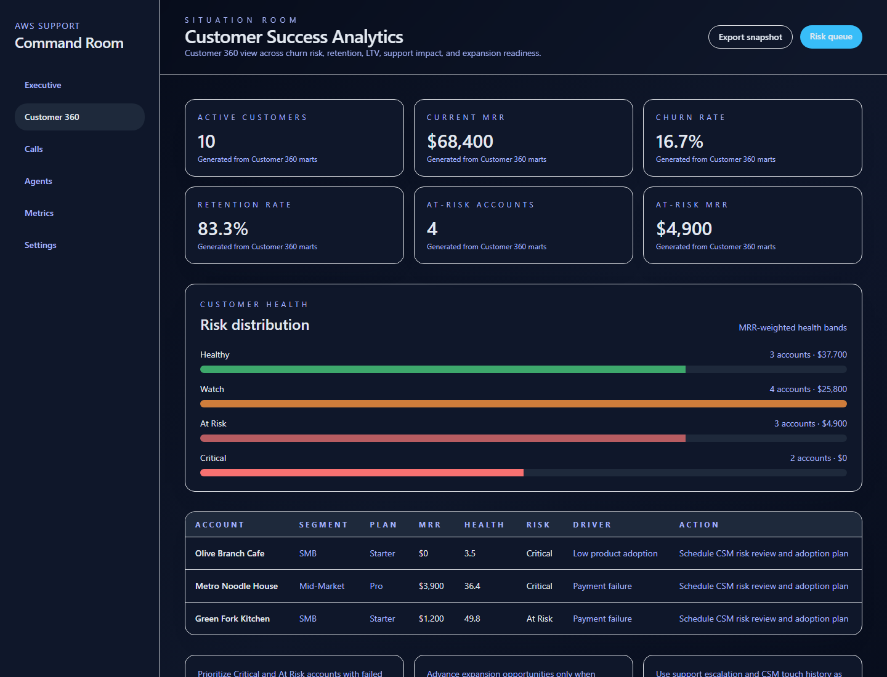
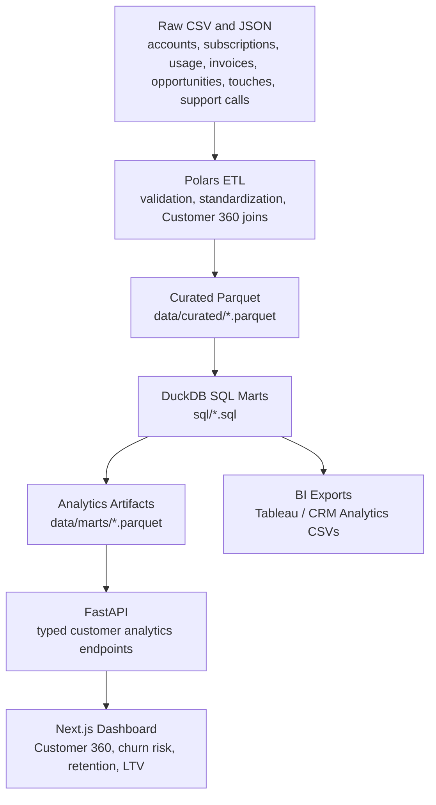
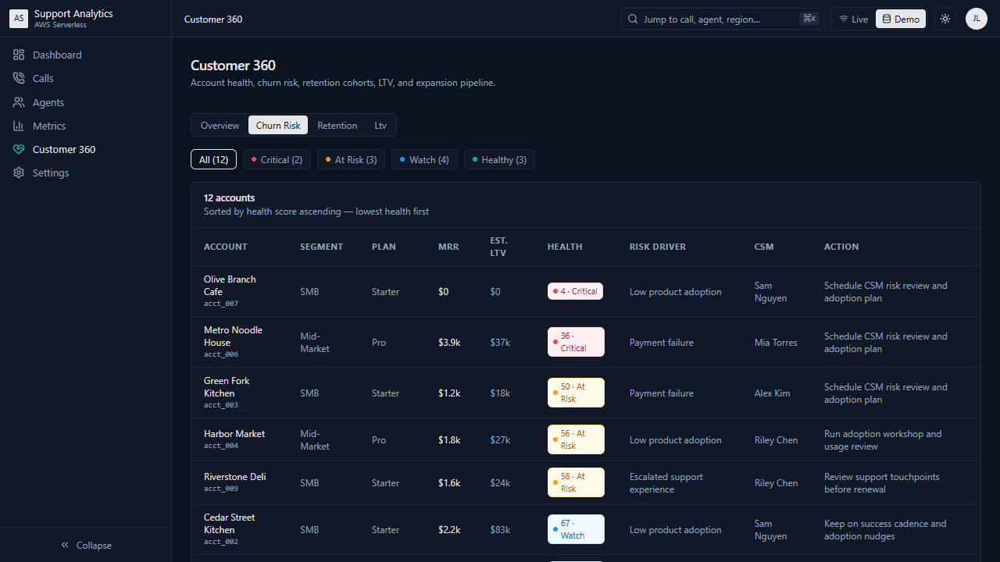
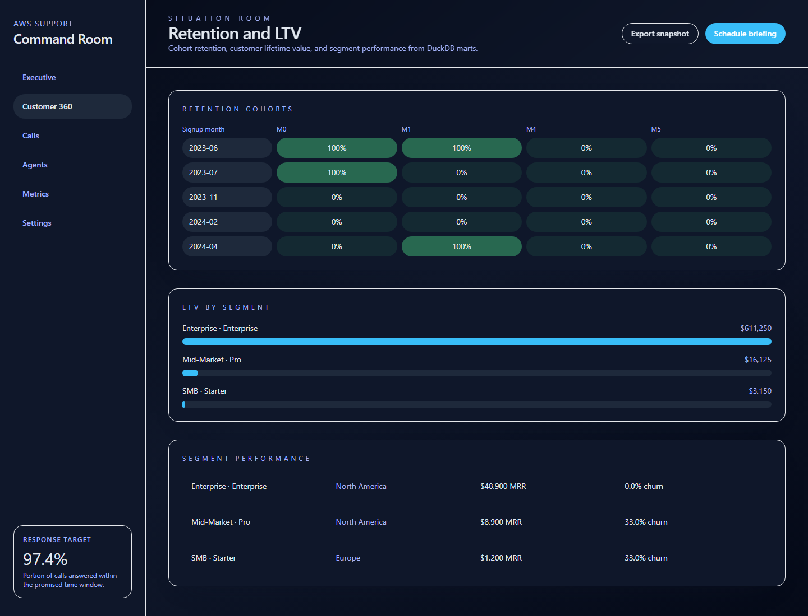

# Customer Success Analytics Command Center


Customer Success Analytics Command Center is a local-first analytics platform for understanding customer health, churn risk, retention, LTV, segmentation, support impact, and expansion opportunities. It models Customer 360 data across accounts, subscriptions, product usage, support interactions, invoices, opportunities, and customer success touches.

The project demonstrates a production-style analytics workflow: Polars ETL validates raw files, DuckDB SQL creates analytics marts, Parquet stores curated outputs, FastAPI serves typed contracts, Next.js renders the dashboard, and CSV exports support Tableau or Salesforce CRM Analytics-style workflows.

**Architecture Diagram**

> Placeholder: add final architecture image at `docs/architecture/customer-success-command-center.png`.

**Dashboard Preview**



## Why This Matters

Customer Success teams need to know which accounts are healthy, which are at risk, how much revenue is exposed, and where support experience is affecting retention. This project turns raw operational data into account-level analytics that a Customer Success Manager, BI Analyst, or Analytics Manager could use to prioritize action.

| Audience | What This Shows |
| --- | --- |
| TouchBistro hiring manager | Restaurant-account analytics, support impact, product usage, expansion, and churn workflows |
| Customer Analytics Manager | Customer 360 modeling, health scoring, churn risk, retention, LTV, and segmentation |
| BI Analyst | SQL marts, clean CSV exports, Tableau-ready datasets, and dashboard-ready metric definitions |
| Data Analytics Manager | Reproducible ETL, typed API contracts, tests, manifests, and local-first delivery |
| Junior Analytics Engineering recruiter | SQL, Python ETL, FastAPI, Next.js, OpenAPI, Parquet, and BI-readiness in one project |

## Business Questions Answered

- Which customers are most likely to churn?
- How much MRR is currently at risk?
- Which customer cohorts retain best?
- Which customer segments generate the highest LTV?
- Which accounts are expansion-ready?
- How does support experience affect churn?
- Which customers should Customer Success prioritize?

## Key Features

### Customer Analytics

- **Churn Risk**: prioritized customer risk queue with health score, MRR, risk driver, and recommended action.
- **Retention Cohorts**: signup-month cohorts for tracking retention over time.
- **Customer Health Scoring**: weighted account health model across usage, payment, support, and CSM engagement.
- **Segmentation**: performance by customer segment, plan tier, region, and restaurant type.
- **LTV Analysis**: estimated customer lifetime value by segment and plan.
- **Expansion Opportunities**: pipeline and readiness view for accounts with strong health and adoption.

### Support Analytics

- **Support Burden**: support volume and burden included as Customer 360 signals.
- **CSAT Analysis**: support experience fields are part of the support analytics model.
- **Resolution Trends**: support resolution status and duration are modeled in the support data path.
- **SLA Tracking**: frontend support dashboards include SLA-oriented service indicators.
- **Escalation Analysis**: escalated support interactions influence customer risk and health context.

### Engineering

- **ETL Pipeline**: raw CSV/JSON inputs are validated and transformed into curated analytics artifacts.
- **FastAPI Backend**: typed endpoints serve support and customer analytics data.
- **DuckDB SQL Analytics Layer**: visible SQL marts power churn, retention, LTV, health, support impact, and segment outputs.
- **OpenAPI Generated Types**: frontend TypeScript contracts are generated from FastAPI OpenAPI.
- **React Query**: dashboard data access is centralized through typed hooks.
- **Static Demo Mode**: GitHub Pages-style static export works without a running backend.
- **BI Export Generation**: Tableau-ready CSV exports are generated from the same SQL mart pipeline.

## Architecture



## Data Model

The central analytical object is an account-level **Customer 360** row.

| Dataset | Purpose |
| --- | --- |
| `accounts.csv` | Customer profile, restaurant type, region, segment, owner, CSM |
| `subscriptions.csv` | Plan tier, MRR, subscription dates, active/churned/trial/paused status |
| `product_usage.csv` | Active days, orders processed, staff logins, feature usage, last login |
| `invoices.csv` | Invoice amount, paid status, failed payments, payment date |
| `opportunities.csv` | Renewal, upsell, cross-sell, winback pipeline |
| `customer_success_touches.csv` | QBRs, check-ins, onboarding, risk reviews, training |
| Support interactions | Support burden, duration, escalation, resolution quality, support experience |

Customer 360 combines these sources into one account-grain dataset with MRR, health score, risk level, risk driver, recommended action, support burden, product engagement, payment health, CSM engagement, and expansion pipeline.

## Analytics Layer

The analytics layer is intentionally visible in SQL under `sql/`. The frontend does not invent core business metrics; it consumes generated marts through FastAPI or deterministic static fixtures.

| Mart | Business Use |
| --- | --- |
| `customer_360` | Full account-level customer view |
| `churn_risk_accounts` | Prioritized churn-risk queue |
| `retention_cohorts` | Cohort retention by signup month |
| `ltv_by_segment` | Estimated lifetime value by segment and plan |
| `customer_health_scores` | Health score components and risk bands |
| `support_impact_on_churn` | Support burden, resolution, and churn relationship |
| `expansion_opportunities` | Expansion-ready account list |
| `segment_performance` | MRR, churn, health, usage, and support by segment |

### Metric Definitions

```text
health_score =
  product_usage_score * 0.35
+ payment_health_score * 0.20
+ support_experience_score * 0.25
+ customer_success_engagement_score * 0.20
```

```text
churn_rate = churned_customers / total_customers
retention_rate = active_customers / total_customers
at_risk_mrr = sum(current_mrr where risk_level in ("Critical", "At Risk"))
estimated_ltv = average_mrr * gross_margin / monthly_churn_rate
gross_margin assumption = 0.75
```

Risk bands:

| Health Score | Band |
| --- | --- |
| 80-100 | Healthy |
| 60-79 | Watch |
| 40-59 | At Risk |
| 0-39 | Critical |

## BI and CRM Analytics Readiness

This project generates CSV exports under `data/bi_exports/` for Tableau-style or BI-tool workflows. It also includes Salesforce CRM Analytics-style documentation under `bi/salesforce_crma/`, including dataset mapping, recipe plan, dashboard wireframe, and SAQL examples.

> This project does not perform a live Salesforce integration. Instead it demonstrates CRM Analytics-ready data modeling and export workflows.

| Asset | Location |
| --- | --- |
| BI exports | `data/bi_exports/*.csv` |
| Tableau notes | `bi/tableau/README.md` |
| Salesforce CRM Analytics mapping | `bi/salesforce_crma/dataset_mapping.md` |
| CRM Analytics recipe plan | `bi/salesforce_crma/recipe_plan.md` |
| CRM Analytics dashboard wireframe | `bi/salesforce_crma/dashboard_wireframe.md` |
| SAQL examples | `bi/salesforce_crma/saql_examples.md` |

## Running the Project

### 1. Install Dependencies

```bash
pip install -r requirements.txt -r backend/requirements.txt
npm --prefix frontend install
```

### 2. Generate Support and Customer Analytics Data

```bash
python scripts/generate_parquet.py --input data/sample_calls.json --agents data/agents.csv --output data/cleaned_calls.parquet
python scripts/generate_customer_analytics.py
```

### 3. Run Backend

```bash
uvicorn backend.app.main:app --reload
```

Backend health check:

```bash
curl http://localhost:8000/api/healthz
```

### 4. Generate API Types

With the backend running:

```bash
npm --prefix frontend run api:generate
```

Or from the checked-in OpenAPI file:

```bash
npm --prefix frontend run api:generate:local
```

### 5. Run Frontend

```bash
npm --prefix frontend run dev
```

Open:

```text
http://localhost:3000/customer-analytics
http://localhost:3000/customer-analytics/churn-risk
http://localhost:3000/customer-analytics/retention
```

## Demo Modes

| Mode | Description | When To Use |
| --- | --- | --- |
| Local live mode | FastAPI reads generated Parquet and mart artifacts; Next.js calls the API | Development and technical review |
| Static GitHub Pages mode | Next.js exports static pages and uses deterministic fallback fixtures | Recruiter portfolio demo without backend |
| BI export mode | CSVs in `data/bi_exports/` are loaded into Tableau, Power BI, Looker Studio, or CRM Analytics-style workflows | BI and analytics manager review |

## Screenshots

The images below are local dashboard screenshots. Add or replace screenshots in `docs/screenshots/` as the UI evolves.

### Dashboard Overview


### Churn Risk



### Retention Cohorts



### Customer Health

> Placeholder: add `docs/screenshots/customer-health.png`.

### LTV Analysis

> Placeholder: add `docs/screenshots/ltv-analysis.png`.

## Engineering Decisions

| Choice | Why It Was Used |
| --- | --- |
| DuckDB | Keeps analytics logic in visible SQL marts, supports local analytical queries, and avoids requiring a warehouse for a portfolio demo |
| Parquet | Stores typed analytical artifacts efficiently and mirrors lakehouse-style workflows |
| Polars | Provides fast, explicit ETL for validating raw files and building Customer 360 outputs |
| FastAPI | Produces typed APIs, OpenAPI schemas, and a clean backend service layer |
| Next.js | Supports a polished dashboard, static export, and recruiter-friendly demo routes |
| React Query | Centralizes async data access, caching, loading states, and static-demo fallback behavior |

## Validation

Recommended checks:

```bash
python scripts/generate_customer_analytics.py
python -m pytest tests backend/app/tests
python scripts/export_openapi.py --output openapi.json
npm --prefix frontend run api:generate:local
npm --prefix frontend run lint
npm --prefix frontend run test
npm --prefix frontend run build
```

## Future Work

- Optional AWS S3 adapter for reading equivalent Parquet artifacts from cloud storage.
- Optional AWS Glue catalog integration for managed table metadata.
- Optional live Salesforce integration for Account, Opportunity, Case, Task/Event, and subscription data.

These are intentionally future work. The current project focuses on the local customer analytics story, BI-ready exports, SQL marts, and a recruiter-friendly dashboard.

## Resume Talking Points

- Built a Customer Success Analytics Command Center modeling accounts, subscriptions, product usage, support interactions, invoices, opportunities, and customer success touches.
- Implemented Polars ETL pipelines that validate raw data, generate curated Parquet datasets, and produce manifest-based analytics artifacts.
- Wrote DuckDB SQL marts for churn risk, retention cohorts, LTV, customer health scoring, support impact, expansion opportunities, and segment performance.
- Exposed customer analytics through typed FastAPI endpoints and generated OpenAPI TypeScript contracts for a Next.js dashboard.
- Created BI-ready CSV exports and Salesforce CRM Analytics-style dataset mapping, recipe planning, dashboard wireframes, and SAQL examples.

## Repository Map

```text
data/raw/                         Raw account, subscription, usage, invoice, opportunity, and CSM touch data
data/curated/                     Curated Parquet outputs
data/marts/                       DuckDB SQL mart outputs
data/bi_exports/                  Tableau-ready CSV exports
sql/                              DuckDB SQL mart definitions
backend/app/routers/              FastAPI routes
backend/app/services/             API service layer
frontend/src/app/customer-analytics/ Customer analytics dashboard routes
frontend/src/features/customer-analytics/ Hooks, mappers, fixtures, and UI components
bi/salesforce_crma/               CRM Analytics readiness documentation
bi/tableau/                       Tableau export notes
docs/screenshots/                 Dashboard screenshots and placeholders
docs/architecture/                Architecture image placeholders
docs/demo/                        Demo script and review notes
```
