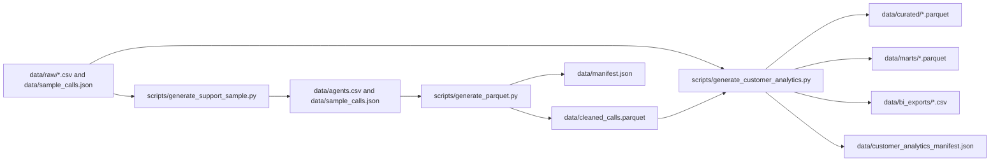
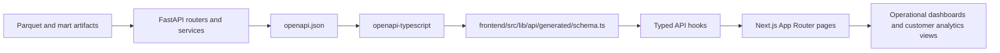
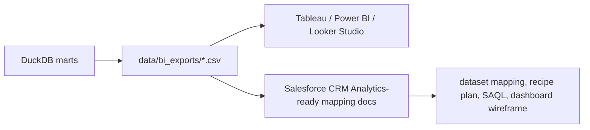

# Customer Success Analytics Command Center


Customer Success Analytics Command Center is an analytics engineering portfolio project that turns raw support and customer-operational data into a publishable analytics product: reproducible ETL, SQL marts, typed APIs, a routed dashboard, and BI-ready exports.

The repo is intentionally local-first. Polars validates and shapes source data, DuckDB materializes marts, Parquet stores curated outputs, FastAPI exposes typed contracts, and a Next.js frontend consumes those contracts through generated types and React Query hooks. The same project can run in live local mode or export as a static demo for GitHub Pages.

## What This Project Demonstrates

- Analytics engineering: deterministic sample generation, ETL validation, curated Parquet artifacts, manifest outputs, and SQL marts.
- Product analytics delivery: a usable frontend with operational support views plus customer analytics routes for churn risk, retention, and LTV.
- Contract discipline: OpenAPI export, generated frontend schema types, typed hooks, and backward-compatible API consumption.
- BI readiness: CSV exports and Salesforce CRM Analytics/Tableau-oriented documentation without pretending a live enterprise integration exists.

## Architecture

### Data Pipeline



### API and Frontend Flow



### BI Export Workflow



## Product Surface

Current routed pages:

- `/dashboard`: support operations overview with KPI cards, call volume, issue mix, region performance, insights, and latest calls.
- `/metrics`: filtered performance drilldown with KPI comparisons, channel quality, SLA context, and regional breakdowns.
- `/calls`: searchable call explorer with focus cards and a paginated interaction table.
- `/calls/[callId]`: single-call detail with timeline, signals, region context, and linked agent information.
- `/agents`: leaderboard and spotlight views for support agent performance.
- `/customer-analytics`: customer success overview across health, churn exposure, actions, and exports.
- `/customer-analytics/churn-risk`: prioritized churn queue.
- `/customer-analytics/retention`: cohort retention and segment summaries.
- `/customer-analytics/ltv`: LTV-focused segment analysis.
- `/settings`: manifest, refresh controls, and environment diagnostics.

The index route redirects to `/dashboard`.

## Data and Contracts

Key generated artifacts:

- `data/cleaned_calls.parquet`: curated support-call dataset produced from deterministic sample data.
- `data/curated/*.parquet`: Customer 360 dimension-style curated outputs.
- `data/marts/*.parquet`: analytical marts for churn risk, retention, LTV, health, support impact, expansion, and segments.
- `data/bi_exports/*.csv`: BI-consumable flat exports.
- `data/manifest.json` and `data/customer_analytics_manifest.json`: refresh metadata and lineage.
- `openapi.json`: checked-in backend contract source for local schema generation.

Key marts:

- `customer_360`
- `churn_risk_accounts`
- `retention_cohorts`
- `ltv_by_segment`
- `customer_health_scores`
- `support_impact_on_churn`
- `expansion_opportunities`
- `segment_performance`

The frontend consumes the backend through generated schema types in `frontend/src/lib/api/generated/schema.ts` and centralized hooks in `frontend/src/lib/api/hooks.ts`. Static demo mode is handled in the data layer, not page-local mocks.

## Local Workflow

### 1. Install dependencies

```bash
pip install -r requirements.txt -r backend/requirements.txt
npm --prefix frontend install
```

### 2. Generate sample and analytics data

```bash
python scripts/generate_support_sample.py
python scripts/generate_parquet.py --input data/sample_calls.json --agents data/agents.csv --output data/cleaned_calls.parquet
python scripts/generate_customer_analytics.py
```

Current sample-data defaults:

- agent roster uses deterministic human names
- call IDs are uppercase in `CALL_0001` format
- generated outputs remain compatible with the backend API and frontend hooks

### 3. Run the backend

```bash
uvicorn backend.app.main:app --reload
```

Optional health check:

```bash
curl http://localhost:8000/api/healthz
```

### 4. Generate frontend API types

Use the live backend when you want to regenerate from the currently running app:

```bash
npm --prefix frontend run api:generate
```

Use the checked-in OpenAPI file when you want a deterministic local regeneration without starting FastAPI:

```bash
npm --prefix frontend run api:generate:local
```

### 5. Run the frontend

```bash
npm --prefix frontend run dev
```

Open `http://localhost:3000/dashboard`.

## Static Demo and Publishing

There are two frontend build paths:

- Local production/static verification:

```bash
npm --prefix frontend run build
```

- GitHub Pages export:

```bash
GITHUB_PAGES=true npm --prefix frontend run build
```

`main` is the source branch. `gh-pages` is reserved for published static output.

Static demo mode is activated by GitHub Pages detection or by setting `NEXT_PUBLIC_STATIC_DEMO=true`, which makes the frontend serve deterministic fixture-backed responses without requiring FastAPI.

## Validation Commands

Recommended full validation pass:

```bash
python scripts/generate_support_sample.py
python scripts/generate_parquet.py --input data/sample_calls.json --agents data/agents.csv --output data/cleaned_calls.parquet
python scripts/generate_customer_analytics.py
python -m pytest tests backend/app/tests
python scripts/export_openapi.py --output openapi.json
npm --prefix frontend run api:generate:local
npm --prefix frontend run lint
npm --prefix frontend run test
npm --prefix frontend run build
```

## Screenshot Workflow

Screenshot capture is manual by design for portfolio-quality output. The required filenames and route coverage live in [docs/screenshots/README.md](docs/screenshots/README.md).

Current checked-in screenshots are limited. Before external sharing, refresh the screenshot set for:

- `/dashboard`
- `/metrics`
- `/calls`
- `/calls/CALL_0001`
- `/agents`
- `/customer-analytics`
- `/customer-analytics/churn-risk`
- `/customer-analytics/retention`
- `/customer-analytics/ltv`

## BI and CRM Analytics Readiness

This project does not claim a live Salesforce, Tableau, or AWS integration. The value is in the modeling and output readiness:

- Tableau notes: `bi/tableau/README.md`
- Salesforce CRM Analytics mapping: `bi/salesforce_crma/dataset_mapping.md`
- Recipe planning: `bi/salesforce_crma/recipe_plan.md`
- Dashboard wireframe: `bi/salesforce_crma/dashboard_wireframe.md`
- SAQL examples: `bi/salesforce_crma/saql_examples.md`

That makes the repo credible for analytics-engineering and BI-platform conversations without overstating operational integrations.

## Repository Map

```text
backend/app/                  FastAPI routers, services, schemas, and tests
data/raw/                     Source customer/account datasets
data/curated/                 Curated Customer 360 parquet outputs
data/marts/                   DuckDB mart parquet outputs
data/bi_exports/              BI-ready CSV exports
frontend/src/app/             Next.js App Router routes
frontend/src/figma/           Routed redesign page compositions and UI primitives
frontend/src/lib/api/         API client, generated schema, hooks, and static demo fixtures
frontend/src/lib/viz/         DTO-to-UI transformers
sql/                          DuckDB mart definitions
scripts/                      Sample generation, parquet generation, analytics generation, OpenAPI export
bi/                           Tableau and CRM Analytics documentation
docs/                         Screenshots, architecture notes, demo notes, resume/interview support
openapi.json                  Checked-in backend contract for deterministic frontend type generation
```

## Why This Reads Well To Employers

- It shows end-to-end ownership across data generation, ETL, mart modeling, API design, typed frontend integration, and documentation.
- It is concrete enough to run locally and audit technically.
- It avoids fake enterprise claims while still showing AWS, BI, and CRM analytics readiness through artifacts and documented workflows.
