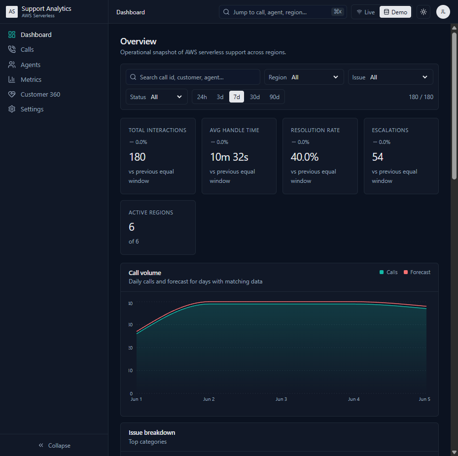
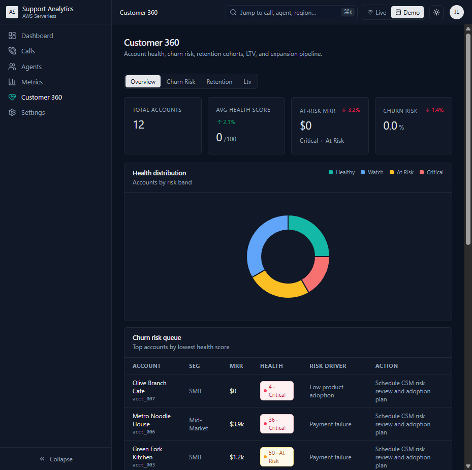
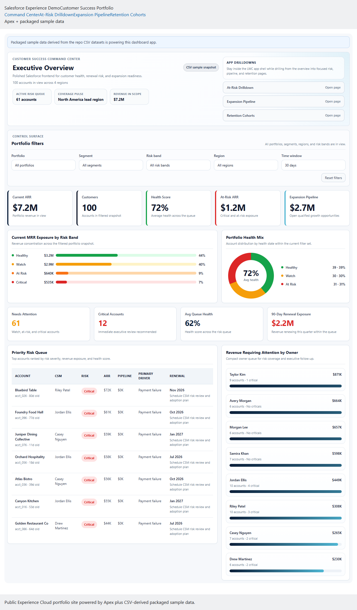
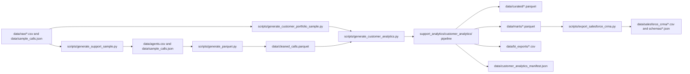
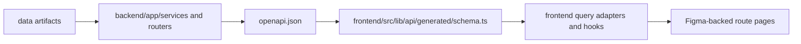

# Customer Success Analytics Command Center


Customer Success Analytics Command Center is a local-first analytics engineering project. It turns raw support, customer, subscription, usage, billing, opportunity, and customer-success data into curated Parquet datasets, DuckDB marts, typed FastAPI APIs, a routed Next.js dashboard, CRM Analytics-ready exports, and a deployed Salesforce LWC command-center app backed by packaged sample data.

The repository demonstrates customer lifecycle analytics, SQL mart design, typed API/frontend integration, dashboard packaging, and Salesforce-native delivery without claiming a live production synchronization layer.

Live demo: `https://bbfosho0.github.io/Customer-Success-Analytics-Command-Center/`

Salesforce demo surface: custom Lightning app `Customer Success Command Center`

Salesforce public surface: Experience Cloud LWR portfolio site with a host-managed four-page LWC dashboard shell backed by packaged sample data.

## Project Purpose and Product Surface

The product surface is split between support operations analytics and customer-success analytics:

- `/dashboard`, `/metrics`, `/calls`, `/calls/[callId]`, and `/agents` cover support volume, SLA-style performance, interaction drilldowns, and agent performance.
- `/customer-analytics`, `/customer-analytics/churn-risk`, `/customer-analytics/retention`, and `/customer-analytics/ltv` cover Customer 360 health, churn prioritization, retention cohorts, LTV, segment performance, support impact, and BI exports.
- `/settings` exposes manifest and refresh diagnostics for local development and static-demo mode.

The frontend currently uses a Figma-backed presentation layer under `frontend/src/figma/`, while routed pages stay thin and delegate data access to typed hooks and adapters under `frontend/src/features/` and `frontend/src/lib/`.

The Salesforce surface is now a separate polished LWC application under `salesforce/force-app/main/default/lwc/` with four pages:

- `Command Center`
- `At-Risk Drilldown`
- `Expansion Pipeline`
- `Retention Cohorts`

Those pages are powered by Apex plus a packaged static-resource sample payload generated from the checked-in CSV analytics exports.

These captures show the main routed web experience:


## Public Surfaces

This project ships with three concrete delivery surfaces:

- GitHub Pages product demo: `https://bbfosho0.github.io/Customer-Success-Analytics-Command-Center/`
- Salesforce-native app: `Customer Success Command Center` Lightning app in the demo org
- Salesforce Experience Cloud site: `https://notapplicable-22b-dev-ed.develop.my.site.com/csccportfolio/?page=command-center`

Public Experience pages:

- Command Center: `https://notapplicable-22b-dev-ed.develop.my.site.com/csccportfolio/?page=command-center`
- At-Risk Drilldown: `https://notapplicable-22b-dev-ed.develop.my.site.com/csccportfolio/?page=at-risk-drilldown`
- Expansion Pipeline: `https://notapplicable-22b-dev-ed.develop.my.site.com/csccportfolio/?page=expansion-pipeline`
- Retention Cohorts: `https://notapplicable-22b-dev-ed.develop.my.site.com/csccportfolio/?page=retention-cohorts`

The Salesforce runtime path uses:

- `CustomerSuccessDashboardController`
- the packaged static resource `CustomerSuccessDashboardSampleData`
- JSON payloads generated from `data/salesforce_crma/*.csv`

Public web screenshots captured with Playwright:





Salesforce Experience command center:



The repository includes the Experience-ready source changes for that path:

- dashboard LWCs are exposed to `lightningCommunity__Page`
- Digital Experiences can be enabled from source with `salesforce/force-app/main/default/settings/Communities.settings-meta.xml`
- the public site stays sample-data-only by continuing to use `CustomerSuccessDashboardController` plus the packaged static resource payload

Current Experience status:

- the Experience site renders all four public LWC dashboards anonymously through one verified route model
- `customerSuccessExperienceHost` owns the public app shell, active top navigation, and query-param routing
- the site shell and metadata are repo-managed under `salesforce/force-app/main/default/digitalExperiences/`
- the public URL model is `...?page=command-center|at-risk-drilldown|expansion-pipeline|retention-cohorts`

## Architecture and Generated Data Flow

### End-to-end workflow



### API and frontend flow



### Current internal structure

- `scripts/generate_customer_analytics.py` is the stable ETL entrypoint.
- `support_analytics/customer_analytics/` contains the actual customer analytics ETL implementation:
  - `sources.py` for raw loading and validation
  - `scoring.py` for Customer 360 enrichment
  - `marts.py` for DuckDB mart/export generation
  - `artifacts.py` for manifest and artifact helpers
  - `pipeline.py` for orchestration
- `backend/app/http/` contains HTTP-layer middleware and shared error handling.
- `backend/app/services/customer_analytics_core/` contains mart caching, overview assembly, list/detail readers, and normalization helpers behind the public service facade.
- `salesforce/design/` contains the CRM Analytics dashboard styling and validation utilities. The Python scripts, design system, and hand-authored guidance are source; generated reports and intermediate dashboard outputs belong under `salesforce/output/`.
- Historical notes or scratch output should not return to `tools/crma_style/`; that older path is intentionally out of the source-of-truth workflow.

## Repo Map and Ownership Boundaries

### Source of truth

- `backend/app/`: FastAPI app, routers, schemas, services, and tests
- `frontend/src/app/`: Next.js routes
- `frontend/src/figma/`: current routed UI compositions and shell
- `frontend/src/features/`: feature hooks, adapters, static demo data, and feature-local types
- `frontend/src/lib/`: shared API client, generated schema consumption, transformers, and utilities
- `support_analytics/`: Python ETL support packages
- `scripts/`: public generation/export entrypoints and compatibility shims
- `sql/`: DuckDB mart definitions
- `salesforce/`: the full CRM Analytics workspace, including metadata, design tooling, tests, manifests, and subsystem docs
- `bi/`: non-Salesforce BI documentation such as Tableau-oriented notes
- `docs/`: architecture notes, screenshots, QA notes, and supporting project docs

### Checked-in generated artifacts

These are intentionally committed because they are part of the portfolio/demo contract:

- `openapi.json`
- `frontend/src/lib/api/generated/schema.ts`
- `data/cleaned_calls.parquet`
- `data/curated/*.parquet`
- `data/marts/*.parquet`
- `data/bi_exports/*.csv`
- `data/customer_analytics_manifest.json`
- `data/manifest.json`
- `data/salesforce_crma/*.csv`
- `data/salesforce_crma/schemas/*.json`

### Local-only or ephemeral artifacts

These should remain untracked:

- editor and local IDE state
- virtual environments and caches
- Playwright scratch data and ad hoc screenshot output
- Salesforce CLI auth state
- generated CRM Analytics QA reports and intermediate `.wdash` files under `salesforce/output/`

### Documentation boundaries

- `docs/architecture/`: technical architecture blueprints and system notes
- `docs/demo/`: demo notes and expansion planning
- `docs/qa/`: temporary but worth-keeping QA or design verification notes
- `docs/screenshots/`: curated screenshots used by the README and demo material

## Local Setup, Validation, and Publish Workflow

### Install dependencies

```bash
pip install -r requirements.txt -r backend/requirements.txt
npm --prefix frontend install
```

### Generate local data

```bash
python scripts/generate_support_sample.py
python scripts/generate_parquet.py --input data/sample_calls.json --agents data/agents.csv --output data/cleaned_calls.parquet
python scripts/generate_customer_portfolio_sample.py --accounts 100
python scripts/generate_customer_analytics.py
python scripts/export_salesforce_crma.py
```

### Run the backend

```bash
uvicorn backend.app.main:app --reload
```

Health check:

```bash
curl http://localhost:8000/api/healthz
```

### Generate the frontend API contract

```bash
python scripts/export_openapi.py --output openapi.json
npm --prefix frontend run api:generate:local
```

### Run the frontend

```bash
npm --prefix frontend run dev
```

Open `http://localhost:3000/dashboard`.

### Full validation subset

```bash
python -m pytest tests backend/app/tests
python scripts/generate_customer_analytics.py
python scripts/export_openapi.py --output openapi.json
npm --prefix frontend run api:generate:local
npm --prefix frontend run test
npm --prefix frontend run build
```

### Static demo and publishing

```bash
GITHUB_PAGES=true npm --prefix frontend run build
```

Static demo mode is enabled by GitHub Pages detection or `NEXT_PUBLIC_STATIC_DEMO=true`. This keeps the public web build deterministic without requiring a live FastAPI service.

## Artifact Policy and CRM Analytics/Tableau Notes

### Artifact policy

- Source code lives under `backend/`, `frontend/`, `support_analytics/`, `scripts/`, `sql/`, `salesforce/`, and selected `docs/`.
- Generated artifacts that are part of the demo contract remain checked in.
- Local-only QA output, caches, auth state, and scratch screenshots are not source and should stay ignored.
- README commands should point at stable public entrypoints, not internal helper modules.
- Root wrappers under `scripts/` may delegate into `salesforce/scripts/` or `support_analytics/`, but they remain part of the public local workflow.

### CRM Analytics readiness

This repository demonstrates both CRM Analytics readiness and a Salesforce-native LWC dashboard application, not live production synchronization.

- `scripts/export_salesforce_crma.py` writes six CRM Analytics-ready datasets to `data/salesforce_crma/`.
- `salesforce/` contains the portable Salesforce DX project, Wave application, dashboards, XMD metadata, style tooling, tests, deploy manifests, the LWC app shell, and the Apex/static-resource sample-data path used by the live Salesforce demo.
- `salesforce/scripts/build_salesforce_crma_metadata.py` is the primary Salesforce metadata builder; the root `scripts/build_salesforce_crma_metadata.py` path remains a compatibility shim.
- `salesforce/scripts/upload_salesforce_crma.py` is the primary dataset upload helper; the root `scripts/upload_salesforce_crma.py` path remains a compatibility shim.
- `salesforce/scripts/build_dashboard_sample_resources.py` generates the packaged Salesforce sample payload consumed by the LWC app.

See:

- [salesforce/README.md](C:/Users/Yoshi/Documents/GitHub/aws-serverless-support-analytics/salesforce/README.md)
- [data/salesforce_crma/README.md](C:/Users/Yoshi/Documents/GitHub/aws-serverless-support-analytics/data/salesforce_crma/README.md)
- [salesforce/design/README.md](C:/Users/Yoshi/Documents/GitHub/aws-serverless-support-analytics/salesforce/design/README.md)

### BI documentation

The project includes implementation-readiness material for CRM Analytics and Tableau-style delivery:

- `salesforce/docs/bi/dataset_mapping.md`
- `salesforce/docs/bi/recipe_plan.md`
- `salesforce/docs/bi/dashboard_wireframe.md`
- `salesforce/docs/bi/saql_examples.md`
- `bi/tableau/README.md`

### Project Characteristics

This project includes:

- customer lifecycle analytics and Customer 360 modeling
- ETL implementation and SQL mart design
- typed backend/frontend contract ownership
- BI export readiness and metadata packaging
- pragmatic product delivery with a local-first demo path
