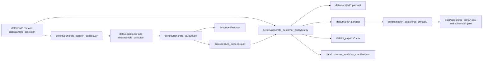
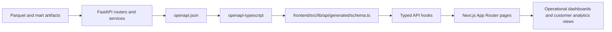
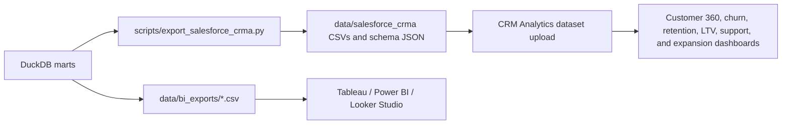
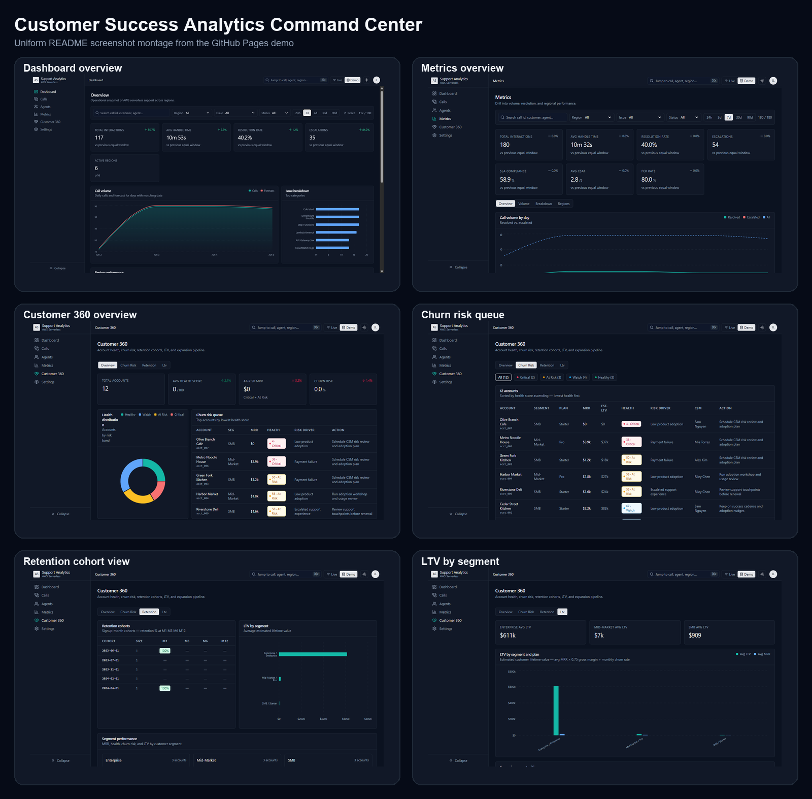

# Customer Success Analytics Command Center


## About This Project

Customer Success Analytics Command Center is a full-stack analytics engineering portfolio product that converts raw customer, subscription, usage, billing, opportunity, and support data into decision-ready customer success intelligence.

The project builds a reproducible analytics workflow from ingestion to delivery: Polars validation and transformation, DuckDB SQL marts, Parquet and CSV outputs, typed FastAPI contracts, and a routed Next.js dashboard. Its business surface focuses on Customer 360 health scoring, churn risk prioritization, retention cohorts, lifetime value analysis, support impact, and expansion opportunities.

This repository is intentionally credible for technical review. It demonstrates AWS-style lakehouse patterns and BI / Salesforce CRM Analytics readiness through working artifacts and mapping documentation, without claiming a live enterprise integration.

Live site: https://bbfosho0.github.io/Customer-Success-Analytics-Command-Center/

## Highlights

- Builds curated Customer 360 data from operational source files and support interaction data.
- Computes account health scores, risk bands, primary risk drivers, and recommended customer-success actions.
- Materializes marts for churn risk, retention cohorts, LTV, customer health, support impact, expansion opportunities, and segment performance.
- Serves typed analytics contracts with FastAPI and generated TypeScript API types.
- Presents routed Next.js views for support operations, account health, churn risk, retention, LTV, and exports.
- Produces BI-ready CSV exports and Salesforce CRM Analytics / Tableau-oriented implementation documentation.

## Architecture

### Data Pipeline



### API and Frontend Flow



### BI Export Workflow



## Product Surface

Current routed pages:

- `/dashboard`: support operations overview with KPI cards, call volume, issue mix, region performance, insights, and latest calls.
- `/metrics`: filtered performance drilldown with KPI comparisons, channel quality, SLA context, and regional breakdowns.
- `/calls`: searchable call explorer with focus cards and a paginated interaction table.
- `/calls/[callId]`: interaction detail with timeline, signals, region context, and linked agent data.
- `/agents`: leaderboard and spotlight views for support agent performance.
- `/customer-analytics`: Customer 360 overview across health, churn exposure, actions, and exports.
- `/customer-analytics/churn-risk`: prioritized churn queue.
- `/customer-analytics/retention`: cohort retention and segment summaries.
- `/customer-analytics/ltv`: lifetime-value analysis by segment and plan.
- `/settings`: manifest, refresh controls, and environment diagnostics.

The index route redirects to `/dashboard`.

## Screenshots

These captures come from the GitHub Pages demo and show the support ops and Customer 360 views recruiters can scan quickly.



## Data Products and Contracts

Key generated artifacts:

- `data/cleaned_calls.parquet`: curated support-call dataset produced from deterministic sample data.
- `data/curated/*.parquet`: curated Customer 360 dimension-style outputs.
- `data/marts/*.parquet`: analytical marts for churn risk, retention, LTV, health, support impact, expansion, and segments.
- `data/bi_exports/*.csv`: flat exports designed for BI tools.
- `data/manifest.json` and `data/customer_analytics_manifest.json`: refresh metadata and lineage artifacts.
- `openapi.json`: checked-in backend contract source for deterministic frontend type generation.

Key marts:

- `customer_360`
- `churn_risk_accounts`
- `retention_cohorts`
- `ltv_by_segment`
- `customer_health_scores`
- `support_impact_on_churn`
- `expansion_opportunities`
- `segment_performance`

The frontend consumes generated schema types in `frontend/src/lib/api/generated/schema.ts` through centralized hooks. Static demo mode is handled in the data layer rather than page-local mocks.

## Local Workflow

### 1. Install dependencies

```bash
pip install -r requirements.txt -r backend/requirements.txt
npm --prefix frontend install
```

### 2. Generate sample and analytics data

```bash
python scripts/generate_support_sample.py
python scripts/generate_parquet.py --input data/sample_calls.json --agents data/agents.csv --output data/cleaned_calls.parquet
python scripts/generate_customer_analytics.py
```

The generated data uses deterministic identifiers and remains compatible with backend contracts and frontend hooks.

### 3. Run the backend

```bash
uvicorn backend.app.main:app --reload
```

Optional health check:

```bash
curl http://localhost:8000/api/healthz
```

### 4. Generate frontend API types

```bash
npm --prefix frontend run api:generate:local
```

To regenerate types from a running FastAPI service instead:

```bash
npm --prefix frontend run api:generate
```

### 5. Run the frontend

```bash
npm --prefix frontend run dev
```

Open `http://localhost:3000/dashboard`.

## Publishing and Static Demo

For local production verification:

```bash
npm --prefix frontend run build
```

For GitHub Pages export:

```bash
GITHUB_PAGES=true npm --prefix frontend run build
```

`main` is the source branch. `gh-pages` is reserved for published static output. Static demo mode is activated by GitHub Pages detection or by setting `NEXT_PUBLIC_STATIC_DEMO=true`, which allows deterministic fixture-backed responses without requiring FastAPI.

## Validation Commands

Recommended full validation pass:

```bash
python scripts/generate_support_sample.py
python scripts/generate_parquet.py --input data/sample_calls.json --agents data/agents.csv --output data/cleaned_calls.parquet
python scripts/generate_customer_analytics.py
python scripts/export_salesforce_crma.py
python -m pytest tests backend/app/tests
python scripts/export_openapi.py --output openapi.json
npm --prefix frontend run api:generate:local
npm --prefix frontend run lint
npm --prefix frontend run test
npm --prefix frontend run build
```

## Salesforce CRM Analytics Export

After generating the customer analytics marts, the repository can produce a dedicated CRM Analytics-ready delivery layer:

```bash
python scripts/generate_customer_analytics.py
python scripts/export_salesforce_crma.py
```

The exporter writes six domain datasets to `data/salesforce_crma/`: Customer 360, churn risk accounts, retention cohorts, LTV by segment, expansion opportunities, and support impact on churn. It converts modeled columns to readable Salesforce-style custom field names and creates field-level schema JSON under `data/salesforce_crma/schemas/` with inferred types and suggested CRM Analytics roles. See `data/salesforce_crma/README.md` for dataset definitions and a Developer Edition upload walkthrough.

This export demonstrates **Salesforce CRM Analytics readiness** for portfolio review. It does not claim a live Salesforce production integration, automated org deployment, or ongoing synchronization.

## BI and CRM Analytics Readiness

This project does not claim a live Salesforce, Tableau, or AWS integration. It demonstrates implementation readiness through analytics artifacts and documentation:

- Tableau notes: `bi/tableau/README.md`
- Salesforce CRM Analytics mapping: `bi/salesforce_crma/dataset_mapping.md`
- Recipe planning: `bi/salesforce_crma/recipe_plan.md`
- Dashboard wireframe: `bi/salesforce_crma/dashboard_wireframe.md`
- SAQL examples: `bi/salesforce_crma/saql_examples.md`

## Repository Map

```text
backend/app/                  FastAPI routers, services, schemas, and tests
data/raw/                     Source customer and account datasets
data/curated/                 Curated Customer 360 Parquet outputs
data/marts/                   DuckDB mart Parquet outputs
data/bi_exports/              BI-ready CSV exports
data/salesforce_crma/          CRM Analytics-ready CSVs, schemas, and upload guidance
frontend/src/app/             Next.js App Router routes
frontend/src/figma/           Routed redesign compositions and UI primitives
frontend/src/lib/api/         API client, generated schema, hooks, and static demo fixtures
frontend/src/lib/viz/         DTO-to-UI transformers
sql/                          DuckDB mart definitions
scripts/                      Data generation, analytics processing, and OpenAPI export
bi/                           Tableau and CRM Analytics documentation
docs/                         Architecture, demo, screenshot, resume, and interview support
openapi.json                  Checked-in backend contract for deterministic type generation
```

## Portfolio Relevance

This project demonstrates end-to-end ownership across analytics engineering, SQL modeling, API design, typed frontend integration, BI export readiness, and clear technical documentation. It is designed to be run, inspected, and discussed in a software development, analytics engineering, business intelligence, or customer analytics interview.
